# Project Development

## Repository Creation

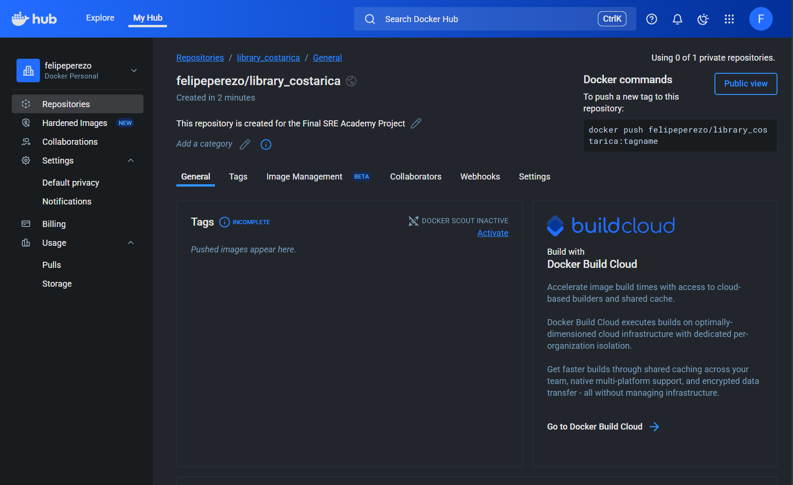

Building image
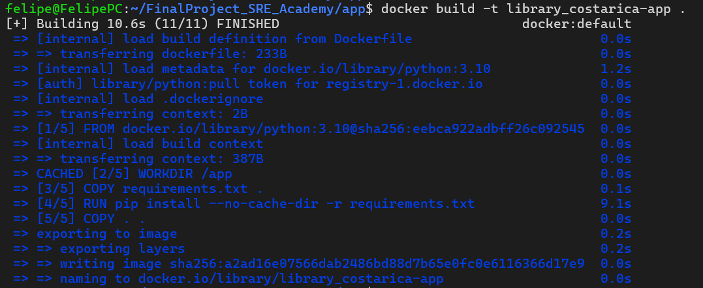

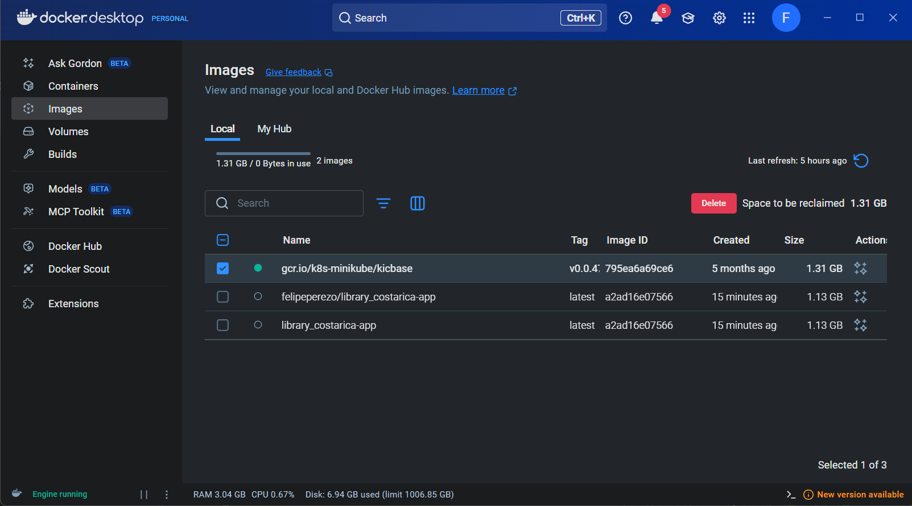
Taging the image
 docker tag library_costarica-app:latest felipeperezo/library_costarica-app:latest

 docker push docker push felipeperezo/library_costarica-app:latest

Minikube dashboard
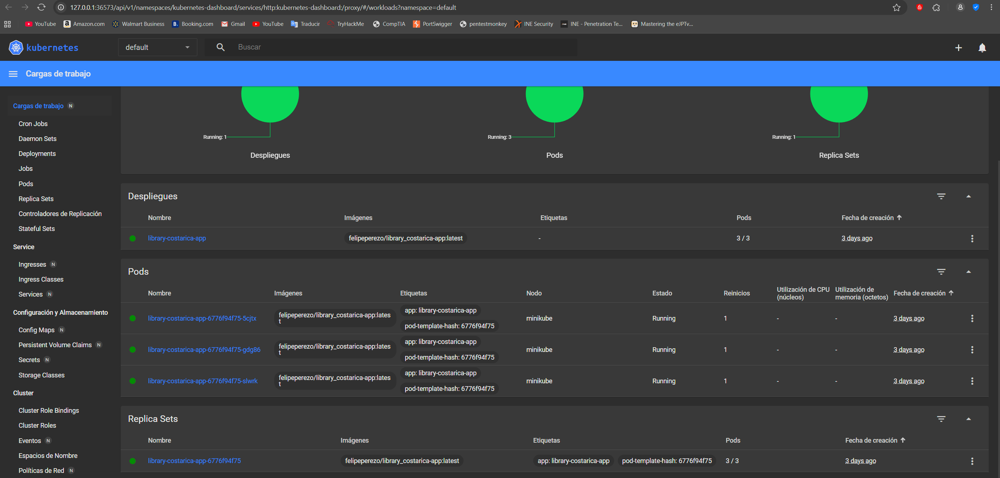

Testing ansible
 ansible-inventory -i inventory.ini --list
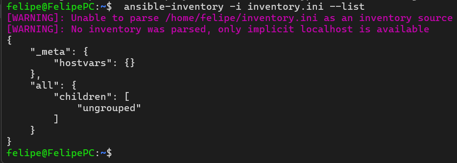

ansible allhosts -m ping -i inventory.ini
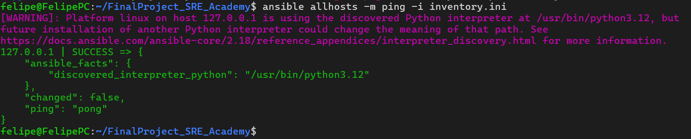

Prometheous pods running
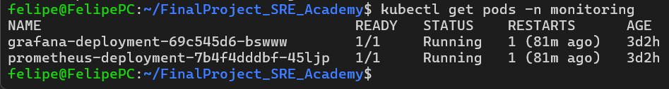

Grafana service
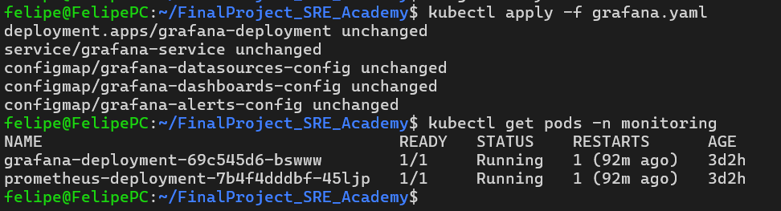

Grafana dashboard
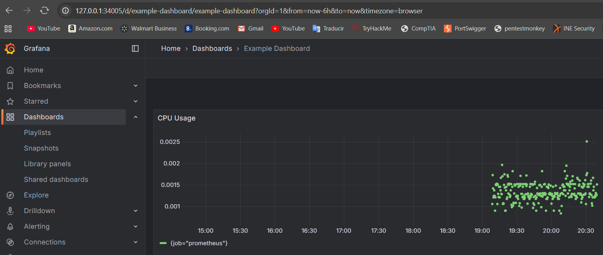

Applying cAdvisor
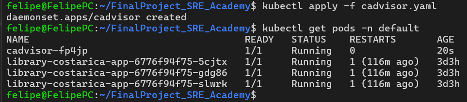

Applying and confirming role
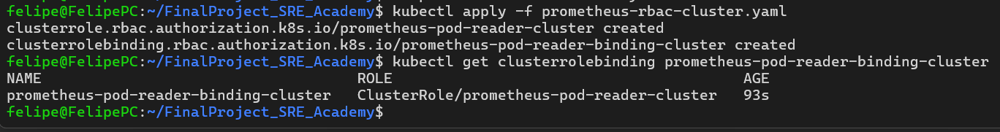

Grafana scraping data
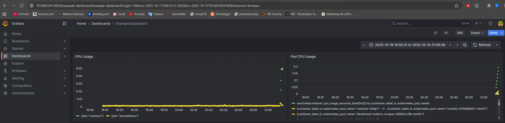
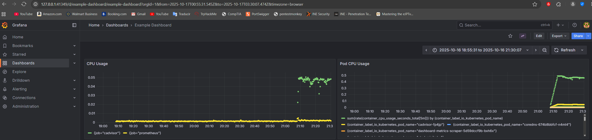

Configuration of otel-collector and jaeger
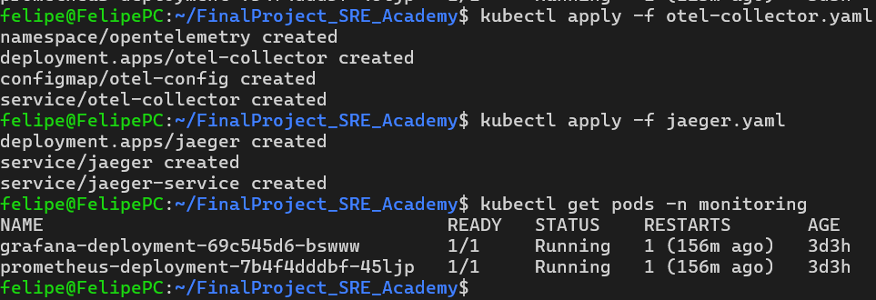

Slack channel
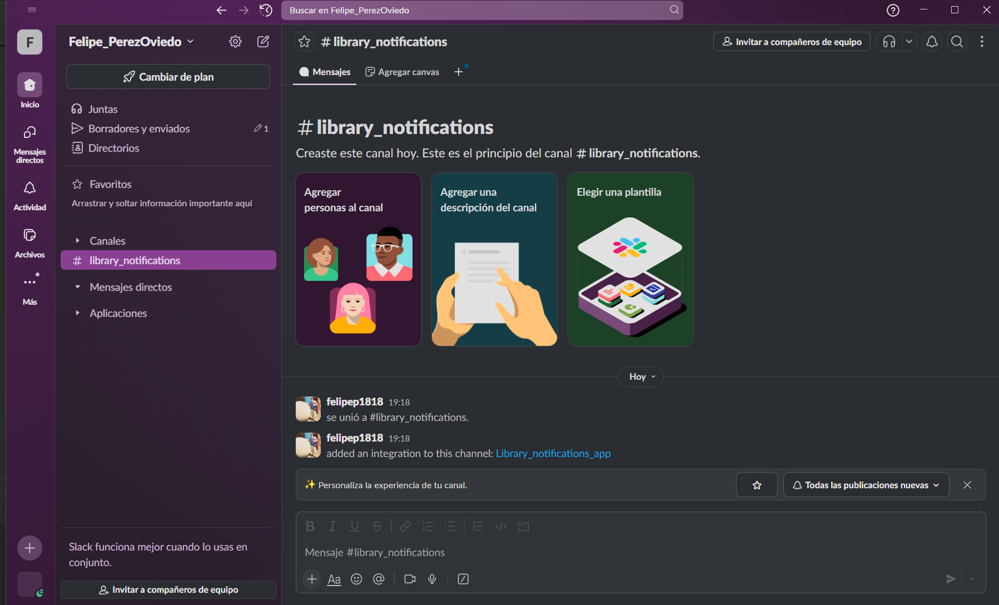

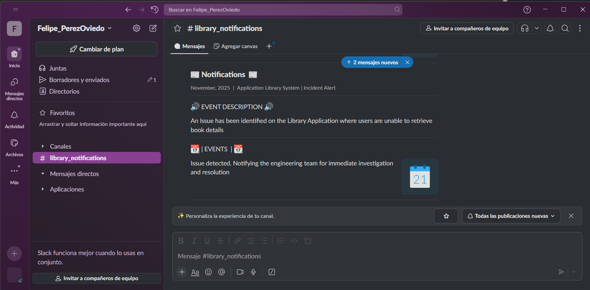