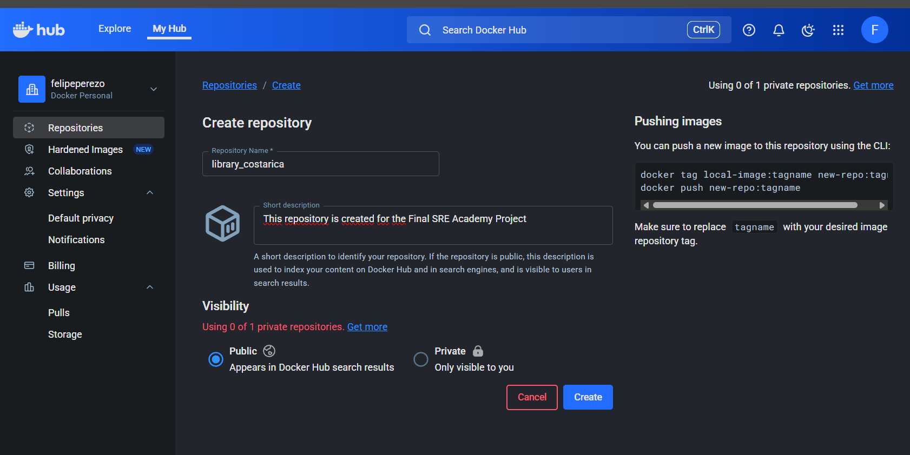

# Project Development

## Repository Creation

Building image

Taging the image
 docker tag library_costarica-app:latest felipeperezo/library_costarica-app:latest

 docker push docker push felipeperezo/library_costarica-app:latest

Minikube dashboard

Testing ansible
 ansible-inventory -i inventory.ini --list

ansible allhosts -m ping -i inventory.ini

Prometheous pods running

Grafana service

Grafana dashboard

Applying cAdvisor

Applying and confirming role

Grafana scraping data

Configuration of otel-collector and jaeger

Slack channel

